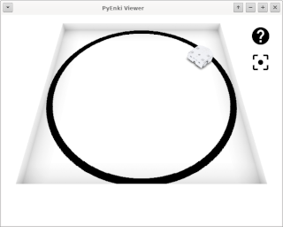
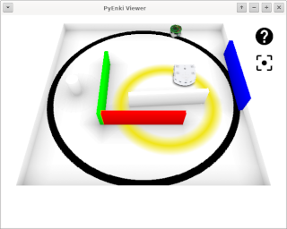
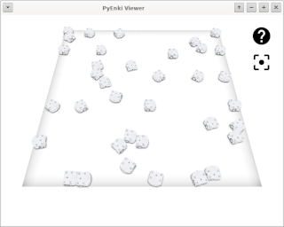
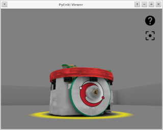
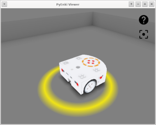
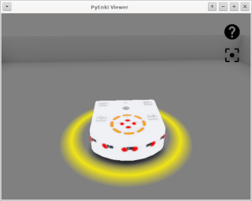
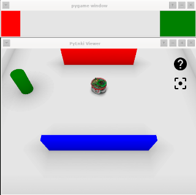
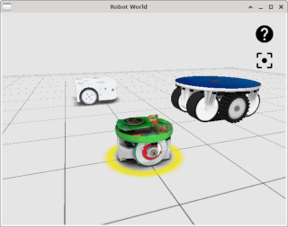

" RobWorld

Simulador de entorno de robots en C++ utilizando [ENKI Robot Simulator](https://github.com/enki-community/enki)

  

  

 

El acceso al simulador es a través de TCP/IP, intercambiando mensajes en formato JSON y utilizando las librerias:

- [robworld-client-java](https://github.com/titos-carrasco/robworld-client-java)
- [robworld-client-python](https://github.com/titos-carrasco/robworld-client-python)

Ejecutables:

- Linux, creado en Debian Testing con QT5-5.15.2
- Windows 32/64, creados en Windows 10 con MSYS2 MinGW y QT5-5.15.2
